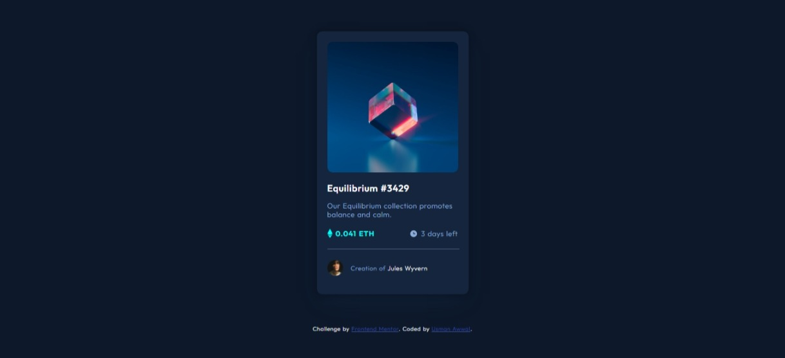
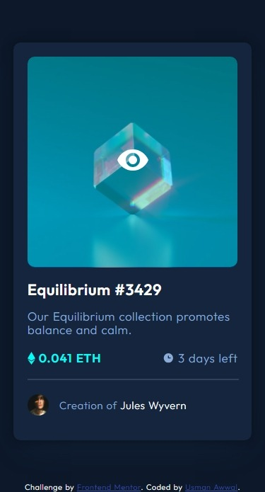

# Frontend Mentor - NFT preview card component solution

This is a solution to the [NFT preview card component challenge on Frontend Mentor](https://www.frontendmentor.io/challenges/nft-preview-card-component-SbdUL_w0U). Frontend Mentor challenges help you improve your coding skills by building realistic projects. 

## Table of contents

- [Overview](#overview)
  - [The challenge](#the-challenge)
  - [Screenshot](#screenshot)
  - [Links](#links)
- [My process](#my-process)
  - [Built with](#built-with)
  - [What I learned](#what-i-learned)
  - [Continued development](#continued-development)
- [Author](#author)
- [Acknowledgments](#acknowledgments)


## Overview

### The challenge

Users should be able to:

- View the optimal layout depending on their device's screen size
- See hover states for interactive elements

### Screenshot





### Links

- Solution URL: [Github repository](https://github.com/USII-004/frontend-mentor-nftPreviewCard)
- Live Site URL: [Netlify](https://fmnpc.netlify.app/)

## My process

- Started with creating the HTML for the page, while taking into account the different headings, text and images.
- Began working on the CSS of the page designings the components using monosapce fonts and white and gray color.
- Included font family from style-guide.md and also color and font size recommendation.
- Proceed to styling the component to make it look like the NFT design.
- Include box-shadow effect on the card.
- Used absolute width for the container as different browser has different display size.
- began adding active/hover state to the components
- Adding hover state to the image as shown in the design was a bit tricky for me, had to imploy the help of chatGPT to find a solution.
- Proceed to work on the mobile view of the card.
- Began documenting (updating README and including screenshots). 

### Built with

- Semantic HTML5 markup
- CSS custom properties
- Flexbox
- CSS Grid
- Mobile-first workflow
- [Normalize CSS](https://necolas.github.io) - For Normalize css


### What I learned

In this challenge I learnt to make hover state that has a color and SVG overlay over the hovered image. this was pretty tricky but i can able to accomplich it using the code below.


```html
<div class="img-container">
      
      <div class="overlay">
        <div class="color-overlay"></div>
        <div class="icon-overlay">
          <svg width="48" height="48" xmlns="http://www.w3.org/2000/svg"><g fill="none" fill-rule="evenodd"><path d="M0 0h48v48H0z"/><path d="M24 9C14 9 5.46 15.22 2 24c3.46 8.78 12 15 22 15 10.01 0 18.54-6.22 22-15-3.46-8.78-11.99-15-22-15Zm0 25c-5.52 0-10-4.48-10-10s4.48-10 10-10 10 4.48 10 10-4.48 10-10 10Zm0-16c-3.31 0-6 2.69-6 6s2.69 6 6 6 6-2.69 6-6-2.69-6-6-6Z" fill="#FFF" fill-rule="nonzero"/></g></svg>
        </div>
      </div>
    </div>
```
Used the below styles to make the hovered state. 

```css
.img-container {
  position: relative;
  display: inline-block;
  border-radius: 10px;
}

.overlay {
  position: absolute;
  top: 0;
  left: 0;
  width: 100%;
  height: 98.5%;
  opacity: 0;
  transition: opacity 0.3s ease;
}

.color-overlay {
  position: absolute;
  top: 0;
  left: 0;
  width: 100%;
  height: 100%;
  border-radius: 10px;
  background-color: hsla(178, 100%, 50%, 0.4);
}

.icon-overlay {
  position: absolute;
  top: 50%;
  left: 50%;
  transform: translate(-50%, -50%);
}
 /* HOVER STATE */
.img-container:hover .overlay {
  opacity: 1;
}

```

### Continued development

Working with hovered state with text/image/svg and color overlay and  also more complex hovered state. 

## Author

- Website - [Usman Awwal](https://usman-awwal-portfolio.netlify.app/)
- Frontend Mentor - [@USII-004](https://www.frontendmentor.io/profile/USII-004)
- Twitter - [@usman_smooth](https://www.twitter.com/@usman_smooth)


## Acknowledgments

My sincere appreciation goes to Free Code Camp, learnt everything i know on their site and also my appreciation ges to youtube and chatGPT for being there to guide me with tutorials and correct code samples when i can't seem to get it right.
